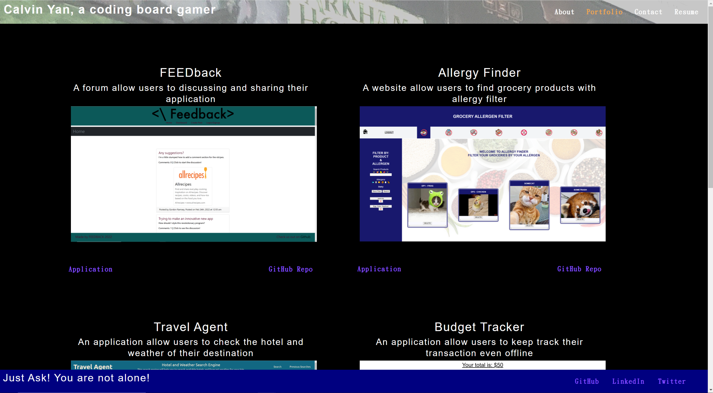
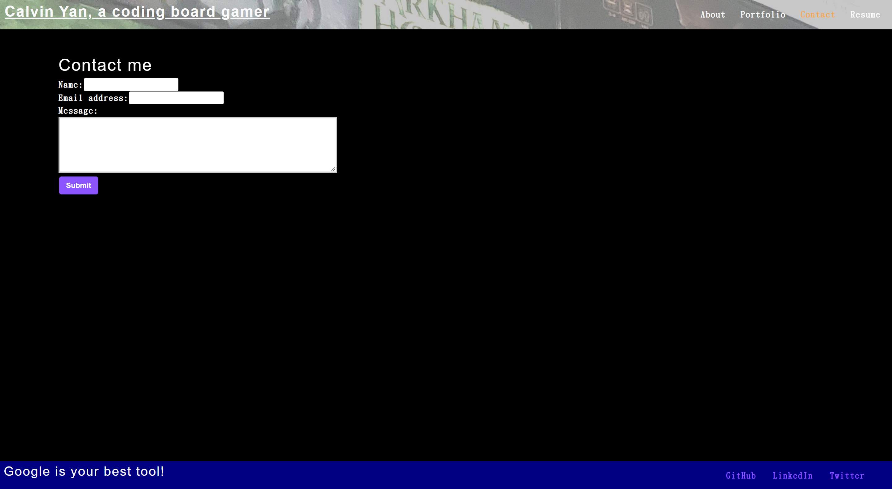
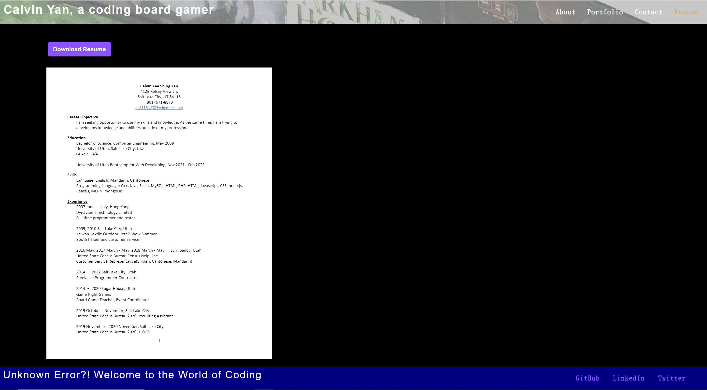

# react-portfolio

## Description

A Professional Portfolio allow viewers to know about me, contact me, browse some of my highlight works, and download my resume.

## Table of Contents

* [Installation](#installation)
* [Usage](#usage)
* [Features](#features)
* [Credits](#credits)
* [Results](#results)
* [Screenshots](#screenshots)

## Installation

To install necessary dependencies, run the following commands in command line:
npm i

## Usage

To use the application locally, run the following commands:
npm start

## Features

1. Bio about Me
2. 6 Highlighted Projects I developed
3. Contact Form
4. Resume view and download

## Credits

Third-Party Assets:
1. React

## Results

Portfolio Page: https://pc611652003.github.io/react-portfolio/

Repository: https://github.com/pc611652003/react-portfolio

## Screenshots

When viewers visit the react portfolio, they will be greeted by About Me Page.
Viewer can see my photo, and know me a bit from the bio.

By choosing Portfolio, viewer can see six of my highlight works. Each Work is presented with photo, link to application or github repository.

Viewer can contact me on this page, they can submit their name, email, and context.

Viewer can view and download my resume on the resume page.

